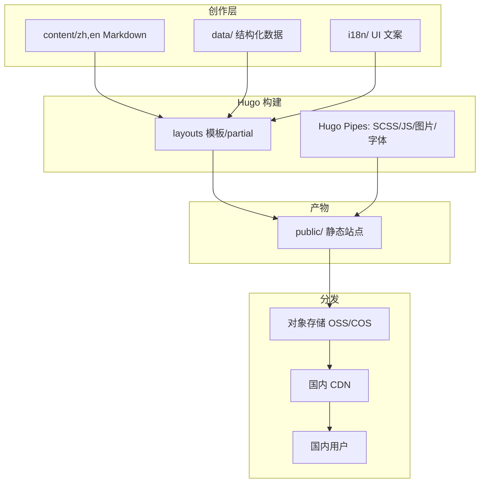

# 02 · 架构与技术栈（Architecture）

> DawnEngine 官方网站开发设计文档 · 第 2 部分
> 上一篇：[01 概述](01-overview.md) · 下一篇：[03 设计系统](03-design-system.md)

## 2.1 技术选型

| 层 | 选型 | 理由 |
| --- | --- | --- |
| 静态站点生成器 | **Hugo Extended**（≥ 0.128，建议固定到 LTS 化的近期稳定版） | 构建极快、原生多语言、内置 Hugo Pipes 资源管线与图片处理（需 Extended 版本支持 SCSS/WebP） |
| 样式 | **Dart Sass + Hugo Pipes**（`css.Sass`） | 设计令牌（tokens）集中管理、构建期编译、按页裁剪 |
| 脚本 | **原生 ES Module + esbuild（Hugo `js.Build`）** | 零框架、体积小、利于国内首屏性能 |
| 内容 | **Markdown（Goldmark）** | 运营友好、Git 工作流、按章节解耦 |
| 多语言 | **Hugo Multilingual** | 中文默认 + 英文，结构镜像 |
| 部署 | 对象存储 + CDN（详见 [05](05-china-cdn-performance.md) / [06](06-deployment-ci.md)） | 纯静态、易缓存、国内加速 |

> 为什么不用 React/Next：官网以内容展示为主、强调国内首屏与可缓存性，纯静态 + 极少量原生 JS 的体积与可缓存性优于 SPA；且规避了客户端水合带来的 TTI 成本。

## 2.2 目录结构（站点根 = 仓库根）

```
dawnengine.com/
├── hugo.toml                 # 站点 + 多语言主配置
├── i18n/                     # UI 文案（按语言）
│   ├── zh.toml
│   └── en.toml
├── content/                  # 正文内容（双语镜像）
│   ├── zh/                   # 默认语言（无 URL 前缀）
│   └── en/                   # 英文（/en/ 前缀）
├── data/                     # 结构化数据（导航、特性卡、生态 logo 等）
│   ├── nav.toml
│   ├── features.toml
│   └── partners.toml
├── assets/                   # 进入 Hugo Pipes 的源资源
│   ├── scss/                 # 设计令牌 + 组件样式（见 03）
│   ├── js/
│   └── fonts/                # 自托管字体子集（见 05）
├── layouts/                  # 自研主题模板（本期仅规格化，见 03）
│   ├── _default/
│   ├── partials/
│   └── shortcodes/
├── static/                   # 直接拷贝的静态资源（favicon、robots、视频 poster 等）
├── archetypes/               # 内容脚手架（front matter 模板，见 04）
├── docs/                     # 本设计文档
└── public/                   # 构建产物（CI 生成，不入库）
```

> 说明：`layouts/` 在本期作为「待实现」目录，其模板/partial/shortcode 清单在 [03 设计系统](03-design-system.md#37-模板清单仅规格) 中规格化；正文内容（content/、i18n/、hugo.toml）为本期实际交付。

## 2.3 多语言配置策略

- 默认语言 **zh**：`defaultContentLanguage = "zh"` 且 `defaultContentLanguageInSubdir = false` → 中文 URL 无前缀（`/features/`）。
- 英文 **en**：带子目录前缀（`/en/features/`）。
- 内容通过 **`translationKey`** 关联同一页面的中英版本（见 [04](04-content-architecture.md)），使语言切换器能精确跳转到对应译文页。
- UI 字符串（按钮、导航标签、页脚等）放 `i18n/zh.toml`、`i18n/en.toml`，模板用 `{{ i18n "key" }}` 调用。

配置骨架（完整文件见 `hugo.toml`，由 site-config 任务交付）：

```toml
baseURL = "https://www.dawnengine.com/"
defaultContentLanguage = "zh"
defaultContentLanguageInSubdir = false

# 注：Hugo 0.158+ 用 label/locale 替代 languageName/languageCode
[languages.zh]
  label = "简体中文"
  locale = "zh-CN"
  contentDir = "content/zh"
  weight = 1

[languages.en]
  label = "English"
  locale = "en-US"
  contentDir = "content/en"
  weight = 2
```

## 2.4 资源管线（Hugo Pipes）

国内首屏性能的核心。统一在模板 `head` 中处理：

```text
SCSS  →  css.Sass  →  postcss(autoprefixer)  →  minify  →  fingerprint  →  <link>
JS    →  js.Build(esbuild, target=es2018)     →  minify  →  fingerprint  →  <script defer>
图片  →  images.Resize/Process → WebP/AVIF + 多尺寸 srcset
字体  →  自托管子集 (见 05)，preload 关键字重
```

要点：
- **指纹化（fingerprint）+ 强缓存**：产物文件名带 hash，配合 CDN `Cache-Control: max-age=31536000, immutable`。
- **关键 CSS 内联**：首屏样式内联，其余异步加载。
- **图片**：内容图统一经 `images` 处理为 WebP（首选）+ 原格式回退，按断点出 srcset（375/768/1024/1440，见 [03](03-design-system.md)）。
- **SRI / 完整性**：`fingerprint` 产出 integrity 值。

## 2.5 数据驱动内容（data/）

为避免在 Markdown 中重复硬编码结构化数据，统一抽到 `data/`：

| 文件 | 用途 |
| --- | --- |
| `data/nav.toml` | 顶部导航与页脚链接（双语 key → i18n） |
| `data/features.toml` | 10 项核心特性的卡片元信息（图标、slug、强调色） |
| `data/partners.toml` | 生态/合作伙伴 logo 墙 |

正文 Markdown 仅承载叙述性内容；卡片、logo 墙等重复结构由模板读取 `data/` 渲染。

## 2.6 构建与本地预览

```bash
# 安装 Hugo Extended（示意，版本以 06 文档锁定为准）
hugo version            # 确认包含 "extended"

# 本地预览（含草稿、双语）
hugo server -D

# 生产构建（压缩 + GC）
hugo --minify --gc
```

## 2.7 架构总览图



详见 [05 国内访问优化](05-china-cdn-performance.md) 与 [06 部署](06-deployment-ci.md)。
