# 04 · 内容架构与信息架构（Content Architecture）

> DawnEngine 官方网站开发设计文档 · 第 4 部分
> 上一篇：[03 设计系统](03-design-system.md) · 下一篇：[05 国内访问优化](05-china-cdn-performance.md)

## 4.1 信息架构（Sitemap）

```mermaid
flowchart TD
  Home["首页 /"]
  Home --> Features["特性 /features/"]
  Home --> Ecosystem["生态系统 /ecosystem/"]
  Home --> News["新闻 /news/"]
  Home --> Trial["申请试用 /trial/"]
  Home --> Learn["学习 /learn/"]
  Home --> Community["社区 /community/"]
  Home --> Roadmap["路线图 /roadmap/"]
  Home --> About["关于 /about/"]

  Features --> F1["/features/built-on-o3de/"]
  Features --> F2["/features/double-precision-rendering/"]
  Features --> F3["/features/world-partition/"]
  Features --> F4["/features/htn-ai/"]
  Features --> F5["/features/flight-navigation-3d/"]
  Features --> F6["/features/vehicle-system/"]
  Features --> F7["/features/pixel-streaming/"]
  Features --> F8["/features/multi-channel-rendering/"]
  Features --> F9["/features/cesium-geospatial/"]
  Features --> F10["/features/domestic-os/"]

  News --> NPost["/news/<slug>/"]
```



## 4.2 顶部导航（参考 CryEngine）

CryEngine 顶栏为：Features / Games / Marketplace / Learn / Community / Roadmap / Get CryEngine。DawnEngine 映射为：

| 导航项 | 链接 | 说明 |
| --- | --- | --- |
| 特性 Features | `/features/` | 引擎能力总览 + 10 个详情页 |
| 生态 Ecosystem | `/ecosystem/` | 合作伙伴、行业方案、工具链（对应 CryEngine 的 Games/Marketplace） |
| 学习 Learn | `/learn/` | 文档、教程、API |
| 社区 Community | `/community/` | 论坛、贡献、活动 |
| 路线图 Roadmap | `/roadmap/` | 版本规划 |
| 新闻 News | `/news/` | 公告与博客 |
| 申请试用 Trial | `/trial/` | 主 CTA（橙色按钮）：试用申请 + 商业授权 |
| 语言切换 | — | 中/EN |

导航数据放 `data/nav.toml`，标签文案走 `i18n/`，便于双语与维护。

## 4.3 URL 与多语言策略

| 语言 | 前缀 | 示例 |
| --- | --- | --- |
| 中文（默认） | 无 | `https://www.dawnengine.com/features/world-partition/` |
| 英文 | `/en/` | `https://www.dawnengine.com/en/features/world-partition/` |

- 同一逻辑页面的中英版本通过 **`translationKey`** 关联（值在两语言文件中相同）。
- 语言切换器读取 `.Translations` 跳转到对应译文，缺失译文时回退到该语言首页。
- 所有页面输出 `hreflang` 备用链接（SEO，见 [05](05-china-cdn-performance.md)）。

## 4.4 内容目录结构（双语镜像）

```
content/
├── zh/
│   ├── _index.md                     # 首页
│   ├── features/
│   │   ├── _index.md                 # 特性总览
│   │   ├── built-on-o3de.md
│   │   ├── double-precision-rendering.md
│   │   ├── world-partition.md
│   │   ├── htn-ai.md
│   │   ├── flight-navigation-3d.md
│   │   ├── vehicle-system.md
│   │   ├── pixel-streaming.md
│   │   ├── multi-channel-rendering.md
│   │   ├── cesium-geospatial.md
│   │   └── domestic-os.md
│   ├── ecosystem/_index.md
│   ├── news/
│   │   ├── _index.md
│   │   ├── dawnengine-1-0-release.md
│   │   └── harmonyos-support-preview.md
│   ├── trial/_index.md
│   ├── learn/_index.md
│   ├── community/_index.md
│   ├── roadmap/_index.md
│   └── about/_index.md
└── en/   (结构完全镜像，同名 translationKey)
```

## 4.5 Front Matter 内容模型

### 4.5.1 通用字段

| 字段 | 类型 | 说明 |
| --- | --- | --- |
| `title` | string | 页面标题 |
| `description` | string | SEO 描述 / 列表摘要（≤ 150 字） |
| `date` | date | 发布日期 |
| `lastmod` | date | 最后修改 |
| `draft` | bool | 草稿（生产构建排除） |
| `translationKey` | string | 跨语言关联键（中英相同） |
| `weight` | int | 排序权重 |

### 4.5.2 首页（home）

```toml
+++
title = "DawnEngine 破晓引擎"
description = "基于 O3DE 二次开发的国产实时 3D 引擎"
translationKey = "home"
type = "home"
[params.hero]
  headline = "构建你的下一个世界"
  subhead = "双精度大世界 · 可解释 AI · 真实地理"
  videoWebm = "/media/hero.webm"
  videoMp4  = "/media/hero.mp4"
  poster    = "/media/hero-poster.jpg"
  ctaPrimary = { label = "申请试用", url = "/trial/" }
  ctaSecondary = { label = "查看特性", url = "/features/" }
+++
```

### 4.5.3 特性详情页（feature single）

```toml
+++
title = "World Partition 世界分区"
description = "自动分区与流式加载的超大世界方案"
translationKey = "feature-world-partition"
weight = 30
[params]
  slug = "world-partition"
  icon = "layers"            # 对应 Lucide 图标名
  accent = "#FF7A00"
  tagline = "无缝大世界，按需加载"
  heroImage = "/media/features/world-partition.jpg"
  specs = [
    { k = "分区方式", v = "网格 / 数据层" },
    { k = "加载策略", v = "基于视距流式" },
  ]
  related = ["double-precision-rendering", "cesium-geospatial"]
+++
```

### 4.5.4 新闻文章（news single）

```toml
+++
title = "DawnEngine 1.0 正式发布"
description = "首个稳定版本带来双精度渲染与 World Partition"
date = 2026-06-20
translationKey = "news-1-0-release"
[params]
  cover = "/media/news/1-0-release.jpg"
  category = "release"        # release | tutorial | community | event
  author = "DawnEngine Team"
+++
```

## 4.6 Archetypes（内容脚手架）

`archetypes/` 提供 `hugo new` 模板，保障 front matter 一致：

| 文件 | 用于 |
| --- | --- |
| `archetypes/default.md` | 通用页 |
| `archetypes/features.md` | `hugo new features/xxx.md` |
| `archetypes/news.md` | `hugo new news/xxx.md` |

> 注：本期直接交付内容 Markdown；archetypes 作为后续运营脚手架建议，落地时按上表 front matter 模型生成。

## 4.7 分类法（Taxonomies）

| Taxonomy | 用于 | 示例值 |
| --- | --- | --- |
| `categories` | 新闻分类 | release / tutorial / community / event |
| `tags` | 跨栏目标签 | world-partition / ai / 国产化 |

新闻列表支持按 `categories` 过滤；特性页 `related` 用 slug 手动关联（避免弱相关自动推荐）。

## 4.8 SEO 与结构化数据

- 每页输出 `<title>`、`description`、Open Graph、Twitter Card。
- 首页与特性页输出 JSON-LD（`Organization` / `SoftwareApplication`）。
- 生成 `sitemap.xml`（Hugo 内置，多语言）与 `robots.txt`。
- `hreflang` 双语互链（见 4.3）。
- 国内搜索引擎友好：提交百度站长、必应；`robots.txt` 放行百度蜘蛛（详见 [05](05-china-cdn-performance.md)）。
