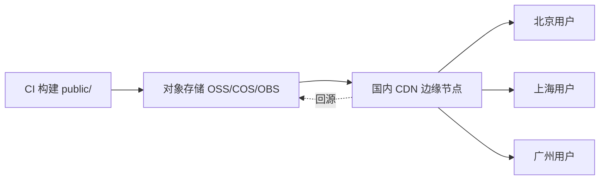

# 05 · 国内访问优化与 CDN（China Access & Performance）

> DawnEngine 官方网站开发设计文档 · 第 5 部分
> 上一篇：[04 内容架构](04-content-architecture.md) · 下一篇：[06 部署与 CI](06-deployment-ci.md)

本节是「国内访问流畅」这一核心约束的落地方案，覆盖：合规备案、CDN、规避被墙第三方、自托管字体/视频、缓存与性能预算。

## 5.1 合规：ICP 备案（前置硬性条件）

- 网站使用国内 CDN / 服务器，域名 **必须完成 ICP 备案**（部分内容还需公安联网备案）。
- 备案主体与服务器/CDN 服务商一致；备案期间域名不可对外服务。
- 页脚必须展示**备案号并链接至 [工信部备案系统](https://beian.miit.gov.cn/)**；如适用，展示公安备案号与图标。
- 时间预留：备案通常需 1–3 周，应在开发期并行启动。

> 这是 dawnengine.com 面向国内的非技术前提，技术方案的所有 CDN 选型都以「已完成备案」为假设。

## 5.2 CDN 与托管架构

纯静态站点，推荐**对象存储 + CDN**组合（任一国内厂商）：

| 方案 | 对象存储 | CDN | 备注 |
| --- | --- | --- | --- |
| 阿里云 | OSS | 阿里云 CDN / DCDN | 国内节点多，控制台成熟 |
| 腾讯云 | COS | 腾讯云 CDN / EdgeOne | 与微信生态结合好 |
| 华为云 | OBS | 华为云 CDN | 信创/政企友好（契合国产化定位） |

架构：



要点：
- 开启 **HTTPS**（CDN 证书）、**HTTP/2**、**Brotli/Gzip** 压缩。
- 开启 **静态压缩缓存** 与 **智能压缩**。
- 大文件（引擎安装包、视频）建议独立 bucket + 独立加速域名，避免影响站点缓存策略。

## 5.3 缓存策略

| 资源类型 | 文件名 | Cache-Control |
| --- | --- | --- |
| 指纹化静态资源（CSS/JS/字体/图片，带 hash） | `app.[hash].css` | `public, max-age=31536000, immutable` |
| HTML 页面 | `index.html` | `public, max-age=0, must-revalidate`（或短 TTL 60s）+ CDN 主动刷新 |
| `sitemap.xml` / `robots.txt` | — | `max-age=3600` |
| 媒体（视频/大图，带 hash） | — | `max-age=2592000` |

- 构建产物指纹化（见 [02](02-architecture.md)）→ HTML 短缓存、资源长缓存、发布即刷新（见 [06](06-deployment-ci.md)）。

## 5.4 规避被墙 / 不可用第三方（关键）

国内访问首屏卡顿多源于外部被墙资源。**严格禁用以下，并给出替代：**

| 禁用（国内不可用/慢） | 替代方案 |
| --- | --- |
| Google Fonts | **自托管字体子集**（5.5） |
| Google Analytics / GTM | **百度统计 / 友盟+ / Matomo 自建** |
| Google reCAPTCHA | 极验 / 阿里云验证码 / hCaptcha 国内不稳→自建 |
| YouTube / Vimeo 内嵌 | **自托管视频** 或 **Bilibili 内嵌**（5.6） |
| Google Maps | **高德 / 百度地图**（如需地图） |
| Gravatar / 海外 CDN 的 JS 库（jsdelivr 部分线路慢、unpkg、cdnjs） | **本地打包**（Hugo Pipes）或国内镜像（如 bootcdn、字节 cdn） |
| Twitter/Facebook 社交挂件 | 站内分享 + 微信/微博分享 |
| 海外 webfont/icon CDN | SVG sprite 本地内联（见 [03](03-design-system.md)） |

原则：**首屏关键路径零外部域名**；第三方统计脚本一律 `async`、置于非阻塞位置，且不影响渲染。

## 5.5 自托管字体（子集化）

中文字体体积大（思源/Noto Sans SC 全量数 MB），必须子集化：

策略：
1. **拉丁字体**（Outfit / Inter / JetBrains Mono）：取所需字重，转 `woff2`，自托管。
2. **中文字体**（Noto Sans SC / 思源黑体）：
   - 方案 A（推荐稳定）：用 [fonttools/pyftsubset](https://github.com/fonttools/fonttools) 或 [中文网字计划 cn-font-split](https://github.com/KonghaYao/cn-font-split) 做**分包（unicode-range 切片）**，浏览器按需加载所用字形。
   - 方案 B：对内容近似静态的页面，按实际用字生成精确子集（适合标题专用字重）。
3. `@font-face` 自托管，关键字重 `preload`，`font-display: swap`。

```scss
@font-face {
  font-family: "Outfit";
  src: url("/fonts/outfit-700.woff2") format("woff2");
  font-weight: 700; font-display: swap;
}
/* 中文分包示例（由 cn-font-split 生成多个 unicode-range 切片） */
@font-face {
  font-family: "Noto Sans SC";
  src: url("/fonts/noto-sc/[hash].woff2") format("woff2");
  font-weight: 400; font-display: swap;
  unicode-range: U+4E00-9FFF; /* 实际由工具拆为多段 */
}
```

`head` 中：

```html
<link rel="preload" href="/fonts/outfit-700.woff2" as="font" type="font/woff2" crossorigin>
```

## 5.6 视频与大图

Hero 视频是首屏体验关键，也是流量大户：

- **格式**：优先 `WebM(VP9/AV1)` + `MP4(H.264)` 回退；提供 `poster` 静态图。
- **加载**：`preload="none"` 或 `metadata`，进入视口再播放；移动端默认**降级为静态图**（节流）。
- **托管**：放独立 CDN 域名；超大演示视频可用 **Bilibili 内嵌**（国内稳定）作为替代，`video` shortcode 支持二选一（见 [03](03-design-system.md) shortcodes）。
- 视频属性：`muted loop playsinline`，尊重 `prefers-reduced-motion`（reduce 时不自动播放）。
- **图片**：经 Hugo `images` 处理为 WebP + 响应式 `srcset`（375/768/1024/1440），`loading="lazy"`、`decoding="async"`、显式 `width/height` 防布局抖动。

## 5.7 性能预算（Performance Budget）

针对国内 4G / 家庭宽带的目标（首屏、首页）：

| 指标 | 目标 |
| --- | --- |
| LCP（国内主要城市） | < 2.5s |
| CLS | < 0.1 |
| INP | < 200ms |
| 首屏关键 CSS | 内联 ≤ 14KB |
| 首屏 JS（gzip） | < 50KB |
| 首屏字体 | ≤ 2 个字重 preload |
| 第三方阻塞请求 | 0 |

落地手段：关键 CSS 内联、JS `defer`/按需、图片懒加载、字体子集 + preload、CDN 边缘缓存、HTTP/2 多路复用。

## 5.8 国内 SEO / 站长

- `robots.txt` 放行 `Baiduspider`、`Sogou`、`360Spider`、`Bingbot`；输出多语言 `sitemap.xml`。
- 提交[百度搜索资源平台](https://ziyuan.baidu.com/)、[必应站长](https://www.bing.com/webmasters)。
- 结构化数据与 `hreflang`（见 [04](04-content-architecture.md)）。
- 主动推送（百度 push API）可在 CI 发布后触发（见 [06](06-deployment-ci.md)）。

## 5.9 安全与头部

CDN/源站统一下发安全响应头：

```
Strict-Transport-Security: max-age=63072000; includeSubDomains; preload
X-Content-Type-Options: nosniff
Referrer-Policy: strict-origin-when-cross-origin
Content-Security-Policy: default-src 'self'; img-src 'self' data:; media-src 'self' https://<video-cdn>; font-src 'self'; script-src 'self' https://<analytics-domain>; style-src 'self' 'unsafe-inline'
```

> CSP 的 `script-src` 仅放行自托管与国内统计域名，与 5.4「首屏零外部域名」一致。
