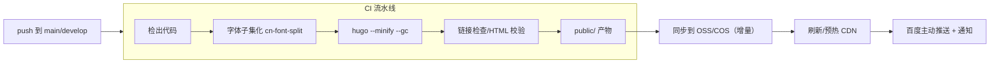

# 06 · 部署与 CI/CD（Deployment）

> DawnEngine 官方网站开发设计文档 · 第 6 部分
> 上一篇：[05 国内访问优化](05-china-cdn-performance.md) · 返回：[01 概述](01-overview.md)

## 6.1 环境

| 环境 | 用途 | 域名（示例） | 数据源分支 |
| --- | --- | --- | --- |
| 本地 | 开发预览 | `localhost:1313` | 任意分支 |
| 预发 Staging | 内部验收 | `staging.dawnengine.com` | `develop` |
| 生产 Production | 对外 | `www.dawnengine.com` | `main` |

- 预发与生产使用**相同构建产物流程**，差异仅在 `baseURL` 与目标 bucket/CDN。
- 预发应加 `X-Robots-Tag: noindex` 或 Basic Auth，避免被收录。

## 6.2 版本锁定

```
Hugo Extended：在 CI 中固定具体版本（如 0.1xx.x extended），避免「构建机器版本漂移」。
Node：用于 cn-font-split / esbuild 工具链时锁定 LTS。
```

在仓库根放置版本声明（建议）：`netlify.toml`/`.tool-versions`/`Dockerfile` 任一，CI 读取同一版本。

## 6.3 构建流程



构建命令：

```bash
hugo --minify --gc --baseURL "https://www.dawnengine.com/"
```

## 6.4 发布到对象存储 + 刷新 CDN

以阿里云为例（其他厂商等价，使用各自 CLI）：

```bash
# 1) 增量同步（保留指纹文件的长缓存，删除已移除文件）
ossutil sync ./public oss://dawnengine-web/ --update --delete

# 2) 刷新被改动的 HTML / 关键入口（指纹资源无需刷新，URL 已变）
aliyun cdn RefreshObjectCaches \
  --ObjectPath "https://www.dawnengine.com/\nhttps://www.dawnengine.com/sitemap.xml" \
  --ObjectType File

# 3) 预热首页与核心特性页
aliyun cdn PushObjectCache --ObjectPath "https://www.dawnengine.com/"
```

要点：
- **指纹化资源（带 hash）**：内容变化即文件名变化，无需刷新，靠 `immutable` 长缓存。
- **HTML / sitemap / robots**：每次发布刷新，保证用户立即拿到新页面。
- 用 `sync --delete` 清理过期产物，避免对象存储垃圾堆积（注意保护媒体大文件目录，必要时分桶）。

## 6.5 CI 平台选型

| 平台 | 适用 | 备注 |
| --- | --- | --- |
| GitHub Actions | 团队在 GitHub | 注意国内厂商 CLI 网络可达性；可用厂商官方 Action |
| Gitee Go / GitLab CI（自建） | 代码在国内托管 | 与国内云厂商连通性更好，构建到发布更稳 |
| 云厂商「云效 / CODING / 流水线」 | 与目标云同厂 | OSS/CDN 凭证打通最省心（**推荐**） |

凭证管理：对象存储 AK/SK、CDN 刷新权限放 CI Secret，**最小权限**（仅目标 bucket + CDN 刷新）。

## 6.6 GitHub Actions 示例（节选，供落地参考）

```yaml
name: deploy
on:
  push:
    branches: [main]
jobs:
  build-deploy:
    runs-on: ubuntu-latest
    steps:
      - uses: actions/checkout@v4
        with: { submodules: recursive, fetch-depth: 0 }
      - name: Setup Hugo (extended, pinned)
        uses: peaceiris/actions-hugo@v3
        with: { hugo-version: '0.1xx.x', extended: true }
      - name: Subset fonts
        run: npx cn-font-split ...   # 见 05
      - name: Build
        run: hugo --minify --gc --baseURL "https://www.dawnengine.com/"
      - name: Upload to OSS & purge CDN
        env:
          OSS_KEY: ${{ secrets.OSS_KEY }}
          OSS_SECRET: ${{ secrets.OSS_SECRET }}
        run: ./scripts/deploy.sh
```

> 若使用 GitHub Actions 但发布目标在国内云，建议把「同步 + 刷新」步骤交给云厂商自有流水线或在国内 runner 执行，以规避跨境网络不稳定。

## 6.7 回滚

- 对象存储开启**版本控制**，发布前打 tag；回滚 = 重新同步上一个 tag 的 `public/` 并刷新 CDN。
- 保留最近 N 次构建产物（CI artifact 或独立 `releases/` 前缀），支持快速回退。

## 6.8 发布检查清单

- [ ] 域名已 ICP 备案，页脚备案号正确（见 [05](05-china-cdn-performance.md)）
- [ ] `baseURL` 指向生产域名，构建无 `draft` 内容
- [ ] 资源指纹化，HTML 短缓存 / 资源长缓存生效
- [ ] CDN 刷新 HTML + sitemap，已预热首页
- [ ] 首屏无外部被墙域名（见 [05](05-china-cdn-performance.md) 5.4）
- [ ] 中英双语可切换，`hreflang` 正确
- [ ] Lighthouse/性能预算达标（LCP < 2.5s）
- [ ] 百度/必应站长已提交，主动推送成功
